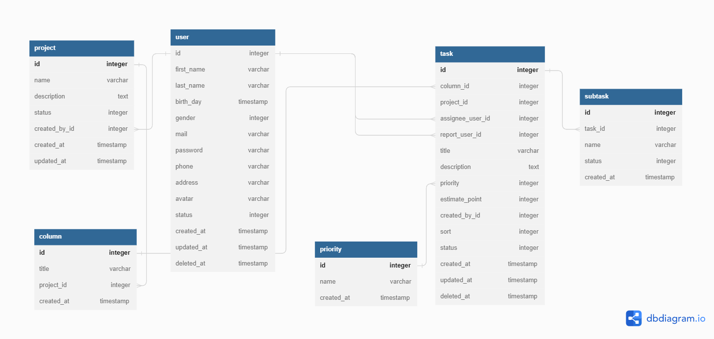

# KANBAN APP

## NESTJS FRAMEWORK

## Database

- MongoDB: mongodb://localhost:27017/be_kanban_app
- Diagram:
  

## Description API

### HTTP CODE

````
Dưới đây là một số mã lỗi HTTP phổ biến và ý nghĩa của chúng:

200 OK: Yêu cầu thành công và phản hồi chứa thông tin được yêu cầu.

201 Created: Yêu cầu đã được thực hiện thành công và một tài nguyên mới đã được tạo.

400 Bad Request: Yêu cầu không hợp lệ do cú pháp sai, tham số thiếu hoặc không hợp lệ.

401 Unauthorized: Yêu cầu yêu cầu xác thực. Người dùng chưa được xác thực hoặc thông tin đăng nhập không hợp lệ.

403 Forbidden: Yêu cầu bị từ chối. Máy chủ hiểu yêu cầu, nhưng từ chối thực hiện hành động được yêu cầu. Thường là do quyền truy cập bị giới hạn.

404 Not Found: Tài nguyên yêu cầu không tồn tại trên máy chủ.

500 Internal Server Error: Lỗi máy chủ nội bộ. Máy chủ gặp sự cố không xử lý được yêu cầu.

503 Service Unavailable: Máy chủ không thể xử lý yêu cầu tại thời điểm đó. Thường được sử dụng khi máy chủ tạm thời bị quá tải hoặc đang bảo trì.
````